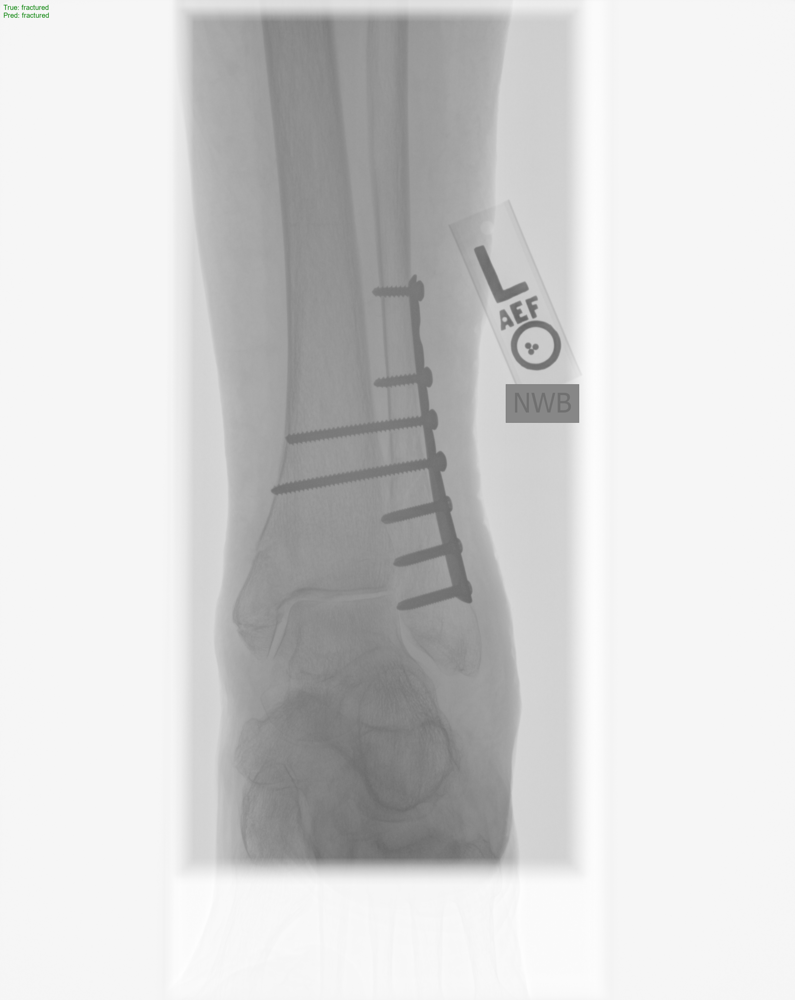
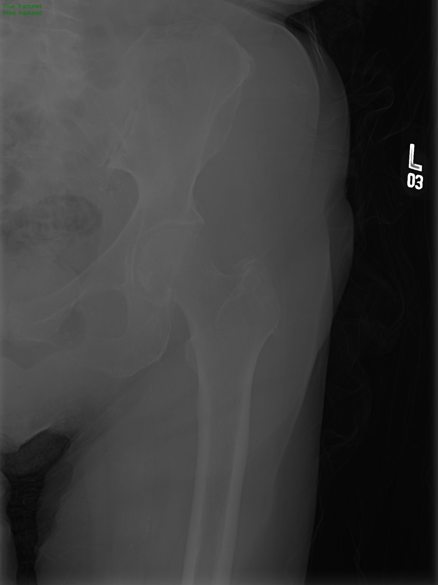
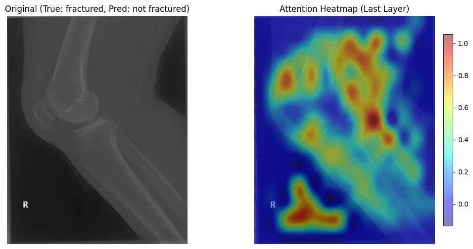
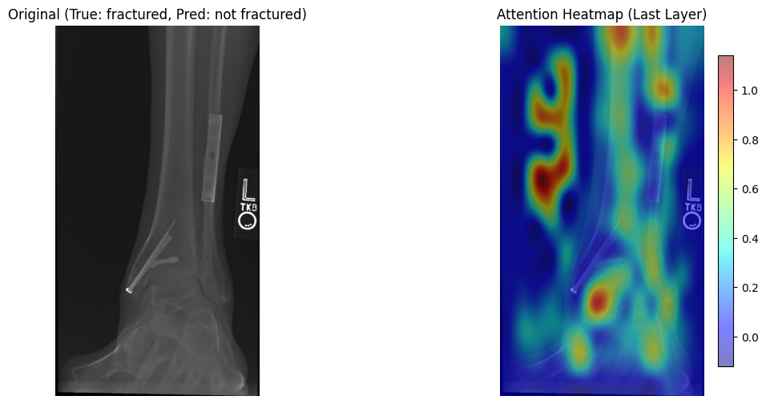

# X-ray Bone Fracture Classifier


A high-performance binary classifier for detecting bone fractures in X-ray images using Vision Transformers (ViT).



## Overview

This project implements a fine-tuned Vision Transformer (`google/vit-base-patch16-224`) to classify X-ray images into two categories:
- **Fractured**
- **Not Fractured**

The model leverages the `transformers` library for the ViT backbone and `torch` for training and inference. It also features a premium terminal UI powered by the `rich` library.

## Performance

The model achieved an accuracy of **83%** on the hold-out test set after 1 epoch of fine-tuning the classification head.

| Metric | Fractured | Not Fractured | Macro Avg |
| :--- | :--- | :--- | :--- |
| **Precision** | 0.84 | 0.82 | 0.83 |
| **Recall** | 0.79 | 0.86 | 0.83 |
| **F1-Score** | 0.81 | 0.84 | 0.83 |

**Accuracy: 0.83**

## Features

- **ViT Backbone**: Uses State-of-the-Art Vision Transformer architecture.
- **Rich UI**: Interactive terminal progress bars, hardware status panels, and formatted logs.
- **CUDA Support**: Automatically detects and utilizes GPU acceleration if available.
- **Error Visualization**: Generates correct and incorrect prediction samples for qualitative analysis.

## Installation

### Dependencies
- Python 3.10+
- PyTorch
- Transformers
- Datasets
- Scikit-learn
- Rich
- Pillow

### Setup
```bash
pip install torch transformers datasets scikit-learn rich pillow
```

## Usage

Run the training and evaluation script:
```bash
python main.py
```

The script will:
1. Check for hardware acceleration.
2. Load and preprocess the X-ray dataset.
3. Train the classification head for 1 epoch.
4. Output a detailed classification report.
5. Save 3 correct and 3 incorrect prediction samples to `prediction_samples/`.

## Sample Results

The model generates visual evidence of its predictions in the `prediction_samples/` directory.

### Correct Predictions
| Correct Sample 0 | Correct Sample 1 |
| :---: | :---: |
|  |  |

## Error Analysis (Interpretability)

To understand why the model fails on certain cases, we utilize **Vision Transformer (ViT) Attention Maps**. By visualizing the attention from the `[CLS]` token to the image patches, we can see where the model is "looking" during classification.

### Why does the model make mistakes?

Our analysis reveals that the primary cause of incorrect predictions is **misaligned attention**. In many error cases, the model fails to focus on the anatomical fracture site and is instead distracted by:
- **Medical Hardware**: Metal plates, screws, and pins.
- **Orientation Markers**: Labels like "R" (Right) or "L" (Left) and other text on the X-ray.
- **Background Noise**: High-contrast areas outside the bone structure.

| Sample Error Analysis 1 | Sample Error Analysis 2 |
| :---: | :---: |
|  |  |

In the examples above, the model predicted "Not Fractured" despite a "Fractured" ground truth because its attention (heatmaps) was concentrated on labels and peripheral markers rather than the subtle fracture lines.


