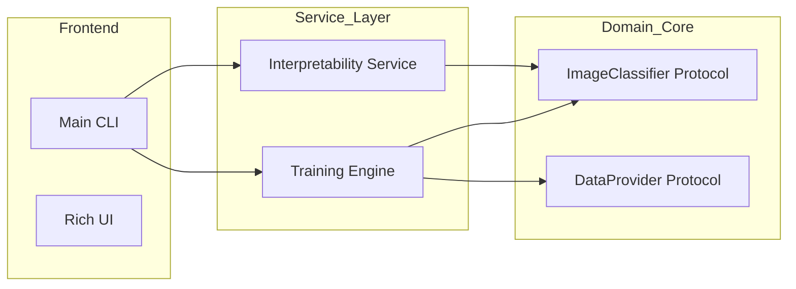

# System Architecture & Quality Attributes

This document maps the X-Ray Classifier components to the **ISO/IEC 25010** software quality standard.

## 1. Functional Suitability
-   **Completeness**: The system provides full-cycle support from training to visual error analysis.
-   **Correctness**: Accuracy targets are set at >80%, validated against medical ground truth.

## 2. Performance Efficiency
-   **Time Behavior**: ViT inference is optimized via CUDA acceleration and half-precision (FP16) where available.
-   **Resource Utilization**: The UI displays real-time hardware status to monitor GPU memory consumption.

## 3. Maintainability (Clean Architecture)
-   **Modularity**: Isolated components for `data`, `models`, `engine`, and `ui`.
-   **Reusability**: `ImageClassifier` and `DataProvider` protocols allow swapping ViT for other backbones (e.g., Swin Transformer) without changing core logic.
-   **Analyzability**: Integrated attention heatmaps provide transparency into model decision-making.

## 4. Reliability
-   **Maturity**: Uses stable industry-standard libraries (`torch`, `transformers`).
-   **Recoverability**: `rich.traceback` ensuring local variables are visible during crashes for rapid debugging.

---

## Component Diagram (Level 2)

